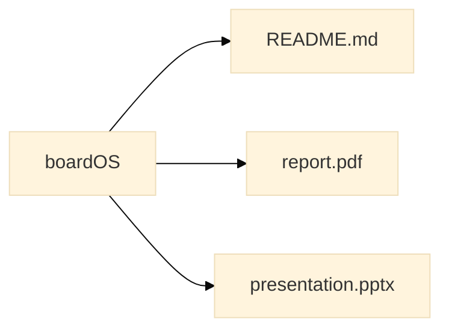
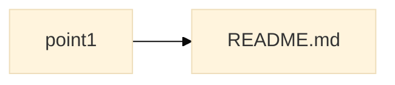
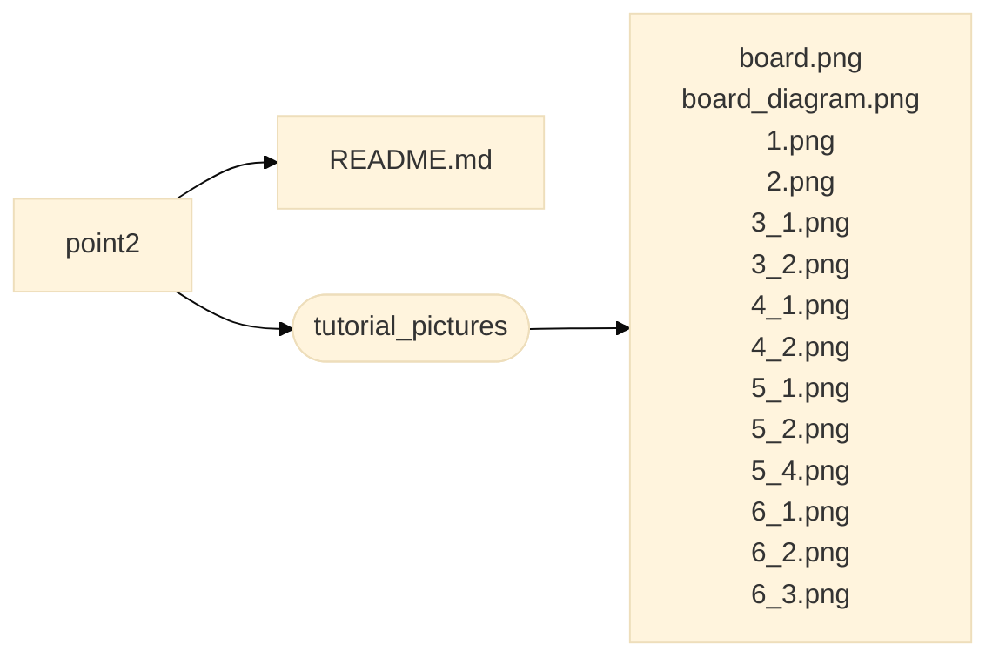

# GUIDE

This README.md file contains an illustration of the project structure and its objectives to allow users to efficiently surf through the various branches.

## 

The aim of the project is to acquire proficiency in the usage of an embedded system on an ST Nucleo Board, specifically STM32 Nucleo-64 Board paired with STM32F446RE MCU.

This project contains the following 5 branches which serve to a specified scope:

| BRANCH    | Objectives |
| --------  | ---------- |
| **boardOS**    | It contains a ***guide*** explaining the structure, the project ***report*** and ***presentation***.  |
| **point1**     | It contains a ***tutorial*** detailing the installation and usage procedures.                         |
| **point2**     | It contains defining practical ***examples*** illustrating the functionalities of the board.          |
| **point3**     | It contains a ***customization*** of the operating system.                                            |
| **point4**     | It contains ***benchmarks*** of the performances achieved by the newly implemented solution.          |
    
Each branch contains a README.md file which better explains its internal structure.

Here is a diagram displaying the contents of each branch. For further information, please refer to the specific branch README.md file.

[comment]: <> (change names or file format for files and add href!!)
[comment]: <> (orientation options: graph LR, graph TD)
[comment]: <> (color options: base, default)

&nbsp;

&nbsp;

&nbsp;

&nbsp;

