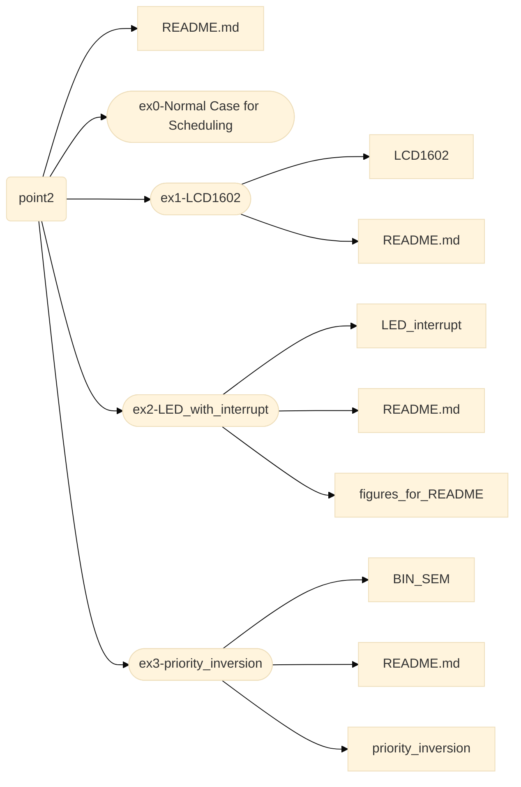

# Structure

This branch contains: 
- <a href="/README.md">**README.md**</a> file: this current file which explains the structure of the branch;
- <a href="/ex0 - Normal case for Scheduling">**ex0 - Normal case for Scheduling**</a> directory: contains a basic example of the FreeRTOS's scheduling;
- <a href="/ex1-LCD1602">**ex1-LCD1602**</a> directory: contains an implementation of an exercise involving LCD;
- <a href="/ex2-LED_with_interrupt">**ex2-LED_with_interrupt**</a> directory: contains an implementation of an exercise involving buttons and leds;
- <a href="/ex3-priority_inversion">**ex-3priority_inversion**</a> directory: contains an implementation of an example of priority inversion.

