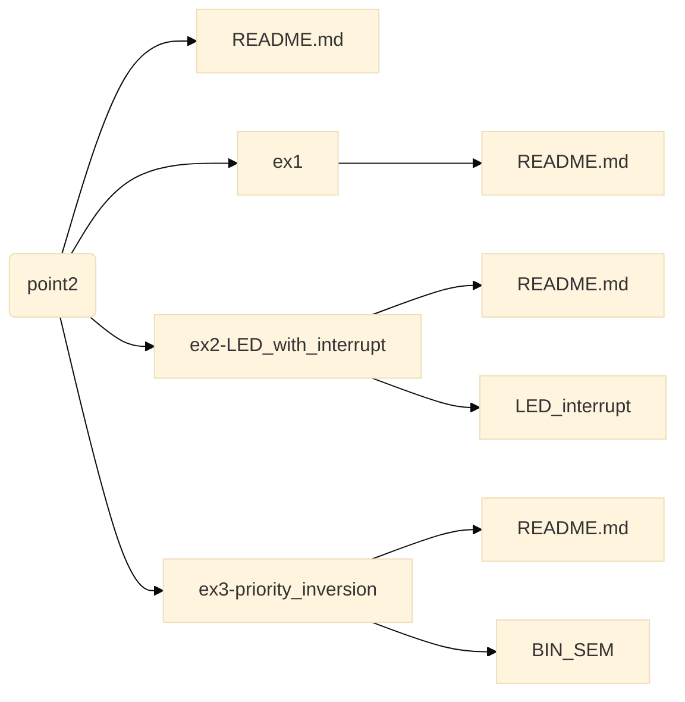

# Structure of the branch

This branch contains: 
- <a href="/README.md">**README.md**</a> file: this current file which explains the structure of the branch;
- <a href="/ex2-LED_with_interrupt">**ex2-LED_with_interrupt**</a> file: contains an implementation of an exercise involving buttons and leds;
- <a href="/ex3-priority_inversion">**ex-3priority_inversion**</a> directory: contains an implementation of an example of priority inversion.

