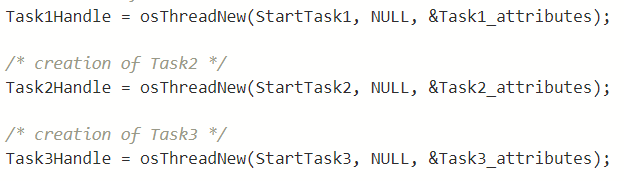

# Example Scheduling of FreeRTOS

## Overview

The example is to show how the default scheduling of FreeRTOS works: a preemptive scheduling based on priority, hence higher priority tasks, when ready, can preempt lower priority tasks. 
After the operation osKernelStart() in the main function, the control is given to the scheduler and the scheduling algorithm. 
There are three main tasks: high, medium and low priority. 
The first task chosen by the scheduler is the high priority task, which is executed 3 times before ending  with osTaskExit().
Then it will be the turn for the medium task and subsequently for the low task, and both will do the same thing as the high priority task.

<figure align="center">
    
    <figcaption>Figure 1: tasks</figcaption>
</figure>

