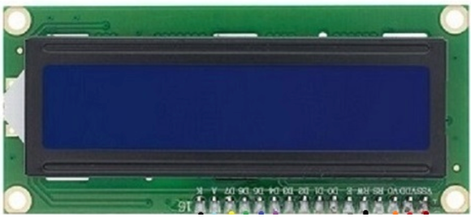
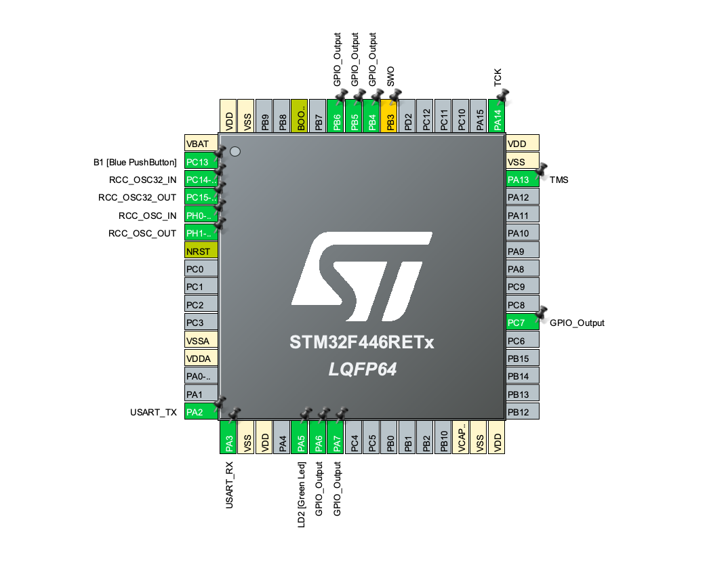

# Example with LCD

## Overview

The display 1602 is a versatile output interface on the which two-line messages can be displayed from 16 characters.
Some of the functionality of the 16 display pins are illustrated in following table:

<table>
<tr><td>Pin number </td><td>Function </td></tr>
<tr><td>1 </td><td>VSS gnd</td></tr>
<tr><td>2 </td><td>VDD 5V</td></tr>
<tr><td>3 </td><td>V0 </td></tr>
<tr><td>4 </td><td>RS register select high=data low=instructions </td></tr>
<tr><td>5 </td><td>R/W High=R; Low=W </td></tr>
<tr><td>6 </td><td>High=enable byte input </td></tr>
<tr><td>15 </td><td>BL-A (5volt) </td></tr>
<tr><td>16 </td><td>BL-K (gnd) </td></tr>
</table>

In general it is possible to say that the configuration of pins 7 to 14 (which can be HIGH or LOW i.e. 0 or 1) represents the byte that are intended to display. The display receives, stores in a register and displays the byte following the instructions given to it through pins 4, 5 and 6.

<figure align="center">
    
    <figcaption>Figure 1: LCD</figcaption>
</figure>

## Setup

The pins configured for communication with the LCD1602 screen are defined in the following part of the code:

    Lcd_PortType ports[] = { GPIOC, GPIOB, GPIOA, GPIOA };
    Lcd_PinType pins[] = { GPIO_PIN_7, GPIO_PIN_6, GPIO_PIN_7, GPIO_PIN_6 };
    Lcd_HandleTypeDef lcd;
    lcd = Lcd_create(ports, pins, GPIOB, GPIO_PIN_5, GPIOB, GPIO_PIN_4, LCD_4_BIT_MODE);
   

The pins for communication with the LCD screen are defined in the ports[] array. They are: GPIOC, GPIOB, GPIOA, and GPIOA.
The specific pins for data communication are defined in the pins[] array. In this case, they are: GPIO_PIN_7, GPIO_PIN_6, GPIO_PIN_7, and GPIO_PIN_6.
Therefore, based on this configuration, the pins for data communication with the LCD screen are:

    D4 (Data 4): Connected to GPIOC, Pin 7

    D5 (Data 5): Connected to GPIOB, Pin 6

    D6 (Data 6): Connected to GPIOA, Pin 7

    D7 (Data 7): Connected to GPIOA, Pin 6

Additionally, the following pins are used for control:

    RS (Register Select): Connected to GPIOB, Pin 5

    EN (Enable): Connected to GPIOB, Pin 4

<figure align="center">
    
    <figcaption>Figure 1: LCD</figcaption>
</figure>

Configure Button B1:

    GPIO_InitStruct.Pin = B1_Pin;
    
    GPIO_InitStruct.Mode = GPIO_MODE_IT_FALLING;
    
    GPIO_InitStruct.Pull = GPIO_NOPULL;
    
    HAL_GPIO_Init(B1_GPIO_Port, &GPIO_InitStruct);

These instructions configure the pin associated with button B1 as an input with pull-up resistance and generate an interrupt when the button goes from high (1) to low (0).

Initialization of the USART2 peripheral:

    MX_USART2_UART_Init();

This function initializes the USART2 peripheral for serial communication.The USART2 peripheral is one of the available serial communication peripherals on the STM32F446RE board. "USART" stands for Universal Synchronous/Asynchronous Receiver/Transmitter, which is a versatile module for transmitting and receiving data.
In simple terms, the USART2 peripheral is used for asynchronous serial communication. Serial communication is a method of transferring data between devices, one bit at a time, along a single connection wire.

<figure align="center">
    
    <figcaption>Figure 1: pin configuration</figcaption>
</figure>

## Execution
Writing on display LCD1602:

    Lcd_cursor(&lcd, 0,3);
    Lcd_string(&lcd, "Time left");
    for ( int x = 600; x >= 1 ; x-- )
    {
        Lcd_cursor(&lcd, 1,7);
        Lcd_int(&lcd, x);
        HAL_Delay (1000);
    }

This code block writes the string "Time left" to the LCD1602 display at position (0,3) and then displays a countdown from 600 to 1 on the second row of the display.
