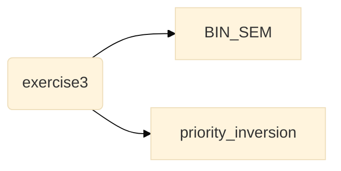
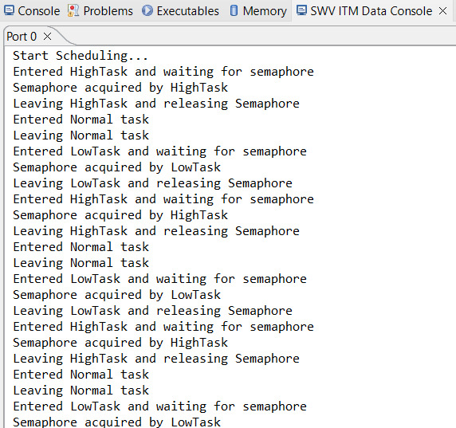

# Priority Inversion

This project has been developed using STM32CubeIDE. 

Hercules has been used as a serial port terminal to catch the data transmitted via the UART (Universal Asynchronous Receiver/Transmitter). 

stm32cubeide: https://www.st.com/en/development-tools/stm32cubeide.html

hercules (available for windows only): https://www.hw-group.com/software/hercules-setup-utility

## Content of this directory

This branch contains:
- <a href="/BIN_SEM">**BIN_SEM**</a> directory: project with the priority inversion bug;
- <a href="/priority_inversion">**priority_inversion**</a> directory: project with the priority inversion solved;



## Overview 

This exercise consist of three tasks with different priorities (HighTask, NormalTask and LowTask) and a binary semaphore.
HighTask and LowTask acquire and release the semaphore under certain condition, MediumTask execute without interactions.

The user button of the Nucleo64 board is used to release the semaphore, firstly taken by the high priority task. 
The semphore used is a binary one, so it has only two states: taken or not taken.

This exercise is specifically design to explain the priority inversion problem that can happen in real-time systems using priority based scheduling. 

## Setup

From the setup page of the project select PIN13 as input, since it is associated with the user button.

<figure align="center">
    
    <figcaption>Figure 1: Pinout configuration</figcaption>
</figure>

Select TIM1 as time source. 

Enable FreeRTOS and select CMSIS_V1 as interface; in this we are exposing the CMSIS API, and we can use CMSIS specific function. This can be useful if we want a more portable code, since CMSIS is widley supported in ARM Cortex-M microcontroller. 

It is possible to create the tasks and the semaphore manually or via the configuration page of the project, that will automatically generate the code.
Configure HighTask with osPriorityAboveNormal, MediumTask with osPriorityNormal and LowTask with osPriorityLow. 


<figure align="center">
    
    <figcaption>Figure 2: Tasks configuration</figcaption>
</figure>


<figure align="center">
    
    <figcaption>Figure 3: Semaphore configuration</figcaption>
</figure>

These private variables will be generated: 
```
osThreadId NormalTaskHandle;
osThreadId HighTaskHandle;
osThreadId LowTaskHandle;
osSemaphoreId BinSemHandle;
```
And also these function prototypes:
```
void Startnormaltask(void const * argument);
void Starthightask(void const * argument);
void Startlowtask(void const * argument);
```
In the main function the tasks and the semaphore will be defined and created: 
```
/* definition and creation of BinSem */
osSemaphoreDef(BinSem);
BinSemHandle = osSemaphoreCreate(osSemaphore(BinSem), 1);

/* definition and creation of NormalTask */
osThreadDef(NormalTask, Startnormaltask, osPriorityNormal, 0, 128);
NormalTaskHandle = osThreadCreate(osThread(NormalTask), NULL);
/* definition and creation of HighTask */
osThreadDef(HighTask, Starthightask, osPriorityAboveNormal, 0, 128);
HighTaskHandle = osThreadCreate(osThread(HighTask), NULL);
/* definition and creation of LowTask */
osThreadDef(LowTask, Startlowtask, osPriorityLow, 0, 128);
LowTaskHandle = osThreadCreate(osThread(LowTask), NULL);
```

In the main there is also the instruction osKernelStart(), that makes the scheduler to begin its work. 
From now on, the interleaving of the tasks will be result of the scheduler and scheduling algorithm. 

By deafult the scheduling algorithm of FreeRTOS is preemptive and based on priority. 

## Execution
Here a more detailed explanation of how the flow of execution proceed, and how this program is specifically written to culminate in a priority inversion. 
### High Task

The HighTask is the first one that the scheduler takes from the ready queue and begins its execution. 

``` 
void Starthightask(void const * argument)
{
  /* Infinite loop */
  for(;;)
  {
	  char *str1 = "Entered HighTask and waiting for semaphore\n";
	  HAL_UART_Transmit(&huart2, (uint8_t *)str1, strlen (str1), 100);

	  osSemaphoreWait(BinSemHandle, osWaitForever);

	  char *str3 = "Semaphore acquired by HighTask\n";
	  HAL_UART_Transmit(&huart2, (uint8_t *)str3, strlen (str3), 100);

	  char *str2 = "Leaving HighTask and releasing Semaphore \n\n";
	  HAL_UART_Transmit(&huart2, (uint8_t *)str2, strlen (str2), 100);

	  osSemaphoreRelease(BinSemHandle);
	  osDelay(500);
  }
}
``` 

It transmits a string and than waits for the semaphore to be taken. Now the sempahore is free, so once the task succeed it transmit two other messages and then release the semaphore. Lastly it begins a waiting period of half a second to permit the execution of the other two tasks with lower priority.

### Medium task
After the execution of the high task, the medium priority task starts: 

``` 
void Startnormaltask(void const * argument)
{
  /* Infinite loop */
  for(;;)
  {
	  char *str1 = "Entered NormalTask\n";
	  	 	  HAL_UART_Transmit(&huart2, (uint8_t *)str1, strlen (str1), 100);

	  	 	  char *str2 = "LeavingNormalTask\n\n";
	  	 	  HAL_UART_Transmit(&huart2, (uint8_t *)str2, strlen (str2), 100);

	  	 	  osDelay(500);
  }
}
```
This task only trasmit two messages, one to informt that it's starting, one to inform it's ending. 

After that it also begins a waiting period. 

### Low Prioriy task
Now it's time for the lower priority task. 

```
void Startlowtask(void const * argument)
{
  /* Infinite loop */
  for(;;)
  {
	  char *str1 = "Entered LowTask and waiting for semaphore\n";
	 	 	  HAL_UART_Transmit(&huart2, (uint8_t *)str1, strlen (str1), 100);

	 	 	  osSemaphoreWait(BinSemHandle, osWaitForever);

	 	 	  char *str3 = "Semaphore acquired by LowTask\n";
	 	 	  HAL_UART_Transmit(&huart2, (uint8_t *)str3, strlen (str3), 100);

	 	 	  while (HAL_GPIO_ReadPin(GPIOC, GPIO_PIN_13)); //wait till the pin go low

	 	 	  char *str2 = "Leaving LowTask and releasing Semaphore \n\n";
	 	 	  HAL_UART_Transmit(&huart2, (uint8_t *)str2, strlen (str2), 100);

	 	 	  osSemaphoreRelease(BinSemHandle);

	 	 	  osDelay(500);

  }
}
```
This third task is a bit more complex: after transmitting a message it acquires the semaphore. After that it begin to wait untile the PIN13 (the one associated to the user button) go low, in other words untile the button is pressed. 

At this time the low priority task is preempte by the higher priority task once it ends it waiting stage of 500 ms. 

Now, high task has to wait for the semaphore to be realsed, since it is still acquired by the low priority task. 

Medium priority task will resume and preempt the low priority task. It has no need for the semaphore to run, so it will start and end. 

Now both the high and the low task are waiting for something (the first one for the semaphore the second for the button to be pressed), so medium task will execute every 500 ms.

Now the important point: *even if i press the button the low task has to wait the medium task to finish its execution. High task will also have to wait for medium task to finish.* Here the priority inversion: the highest priority task to resume it execution has to wait for the medium and the low priority task to finish. 

When the button is pressed, low task will continue its execution and release the semaphore, (after the end of medium task). High task will execute from the waiting point. Then the medium task will run. Now high task execute acquiring and realising the semaphore. At this point medium task should run, but it is suspended for 500ms, so low task begins. It acquire the semaphore and wait for the event. In the meantime medium task will have finished it waiting time so it preempts low task. After waiting for the 500 ms, high task will resume and try to acquire the semaphore,but it has to wait. From now on medium task will preempt the low task every 500ms, as happened in the begging before the button was pressed. 

## Possible Solution
One possible solution for priority inversion is priority inheritance. Priority inheritance consist in raising the priority of a task acquiring a shared resource to the one of the highest-priority task waiting for the same rosource to be released. This mechanism is implemented in FreeRTOS in mutexes. 
Substituiting the binary semaphore with a mutex (mutual exclusive semaphore) the priority of the low task will be raised to the one of high task, so that medium task will no longer preempte the low task.
The operations to create a mutex are:

writing the handler 
```
osSemaphoreId MutexHandle;
```
and then actually creating it with 
```
  osMutexDef(Mutex);
  MutexHandle = osMutexCreate(osMutex(Mutex));
```

The excution will start with the high task acquiring and relasing the semaphore. Then the medium task execute. The low task will begin, acquire the mutex and wait for the button to be pressed: now the execution will stop. 
Once the button is pressed the low task release the mutex and finish its execution, leaving room for the high task to acquire the semaphore. The execution will now go on like that. 

<figure align="center">
    
    <figcaption>Figure 4: Priority inheritance execution</figcaption>
</figure>


